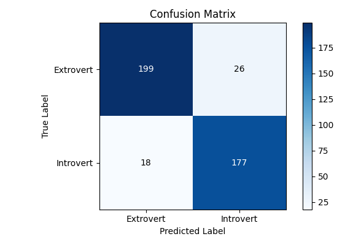
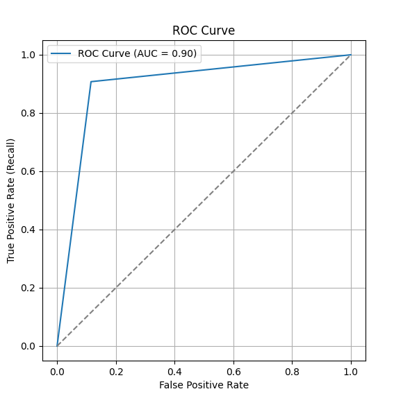
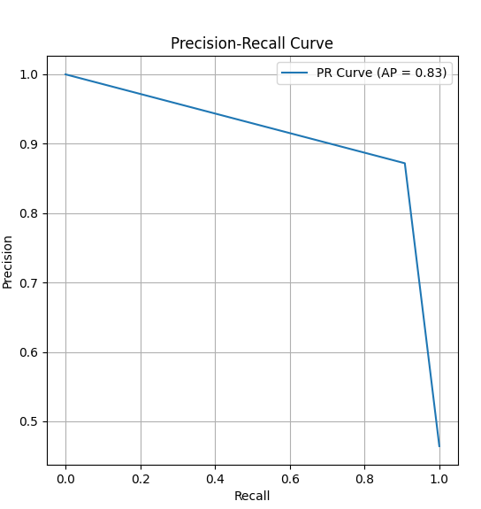

## Introduction
The following project uses an AdaBoost machine learning algorithm to predict personality type(Introvert/Extrovert) based of metrics/data in
'personality_dataset.csv'. The model achieves a reasonably well accuracy(see model accuracy below).
## Case Study

