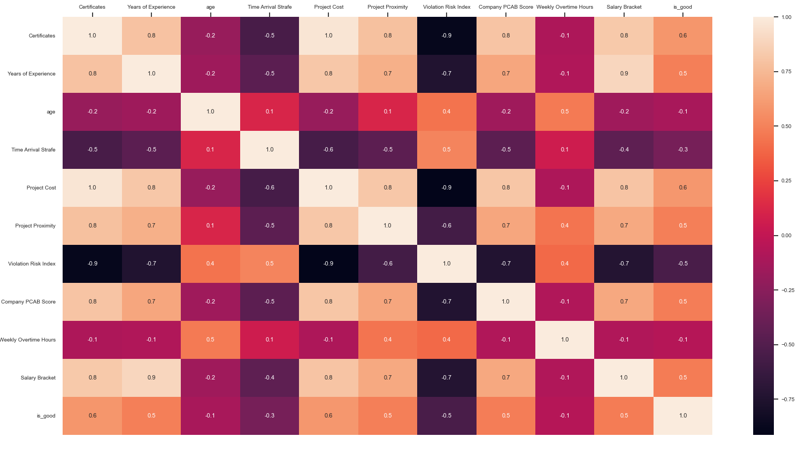
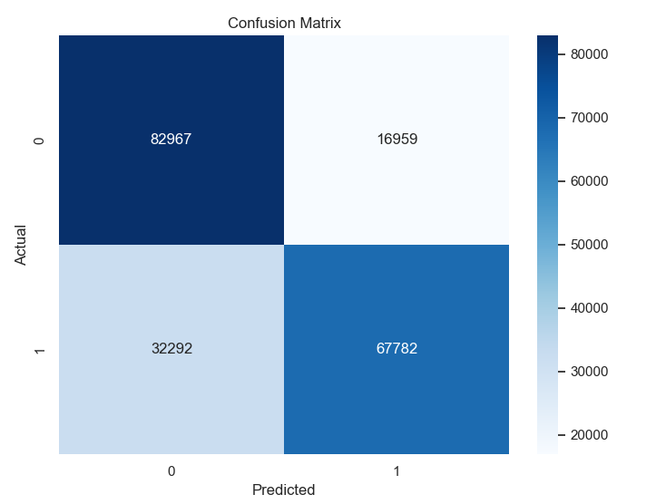

## Introduction
The following machine learning script investigates influence of various factors on a civil engineering projects, namely their perceived outcome/
XGBoost algorithm is used to obtain a reasonably high accuracy. The data is scaled and properly cleaned in the preprocessing part prior to training the model.
## Case Study

