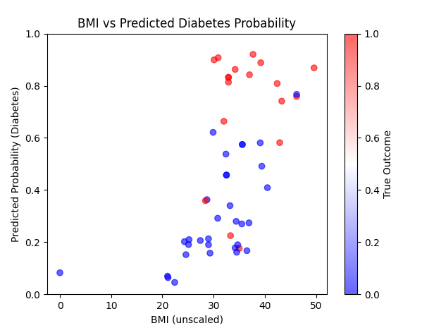
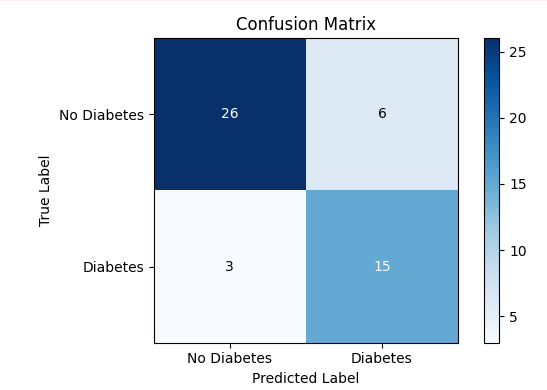
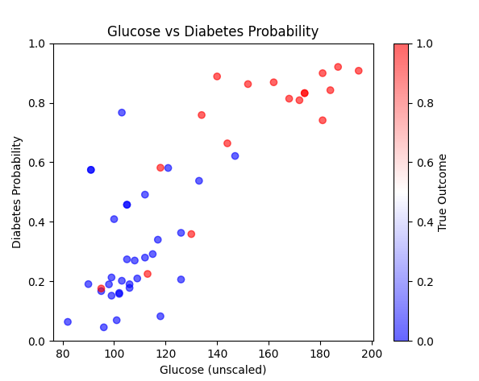

## Introduction
The following project explores the corelation between medical parameters and diabetes diagnose.
Logistic regression is used to achieve great accuracy.
## Case Study(graphs):

## Commands
Set-ExecutionPolicy -ExecutionPolicy RemoteSigned -Scope Process