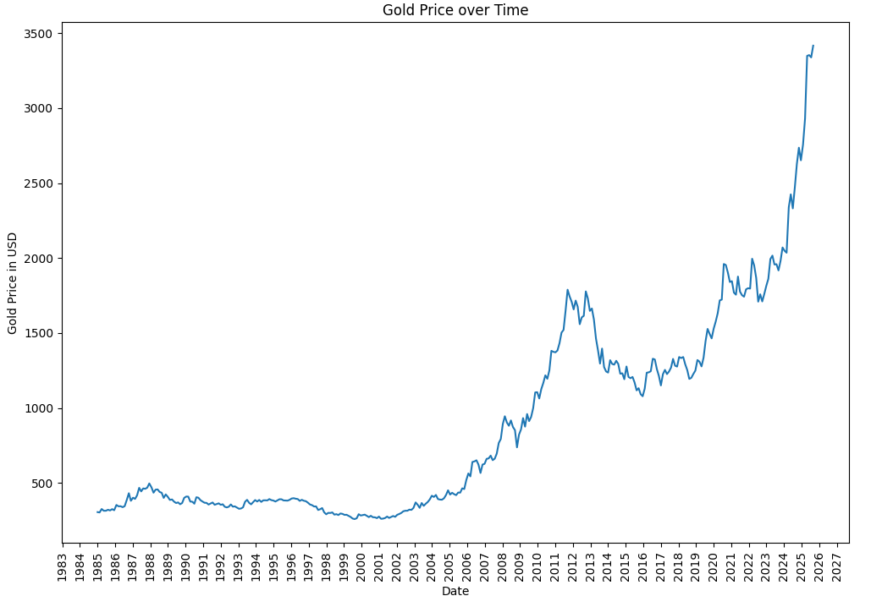
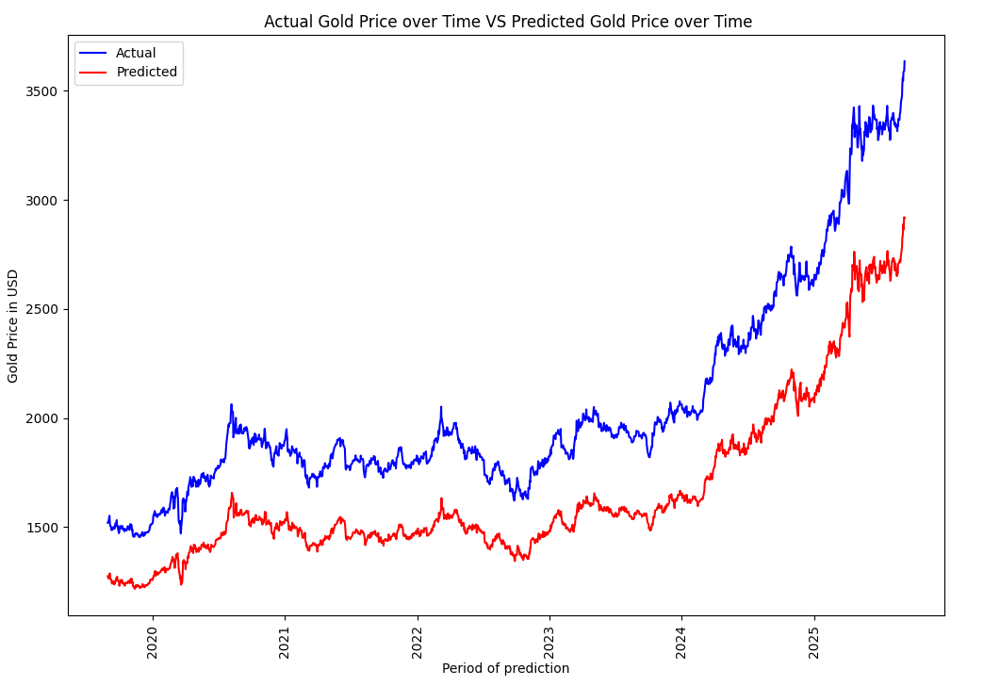
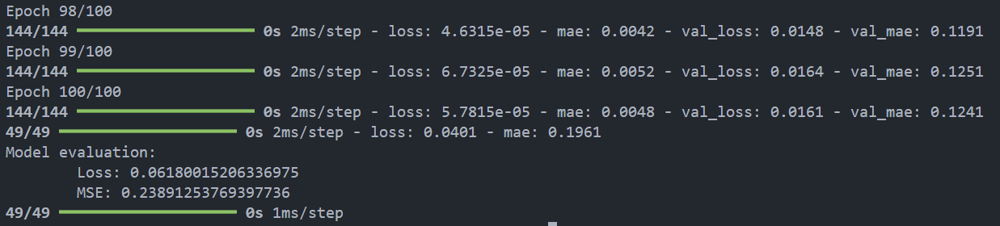

### Introduction
The following project is a time forecast evolution of gold prices. The model is trained on data from 1985-2019 and predicts the prices from 2020-2025. Adam optimizer use and efficient data cleaning and preparation ensure that the predictions are highly accurate. Predictions are made based off of historical prices and global threat levels.

### Case Study

