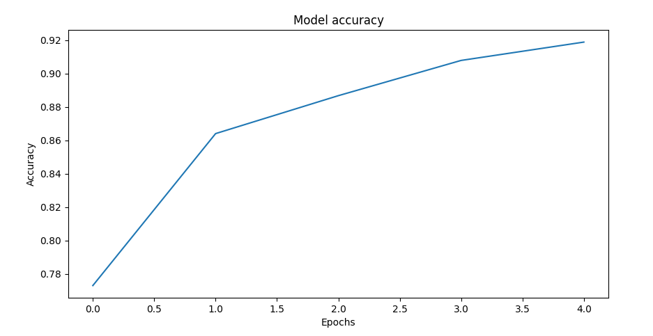
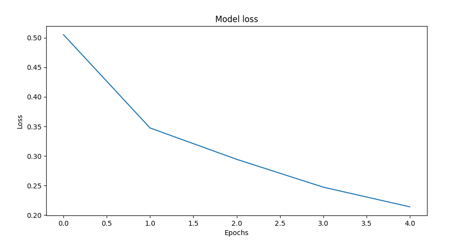
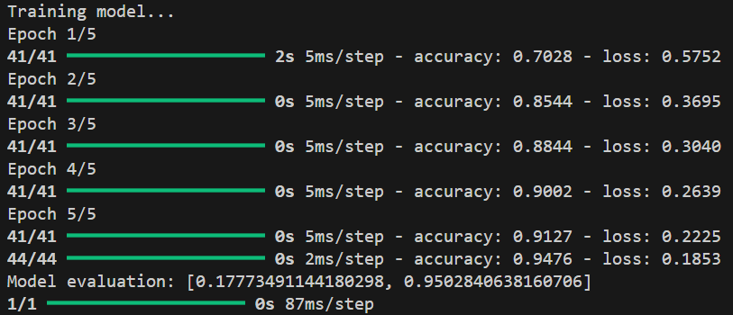

## Introduction
The following exercise entails around binary prediction of kidney stones within an image. The model achieves a relatively high accuracy of 95%. The preprocessing is key to ensure the at most performance- the images are resized to 16x16, converted to RGB format and finally flattened to achieve an uniform process that is effective in further tasks.  

## Case Study

