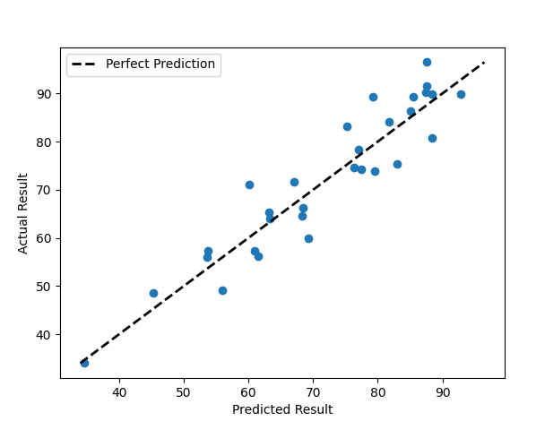
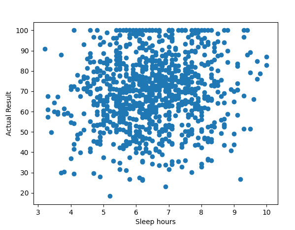
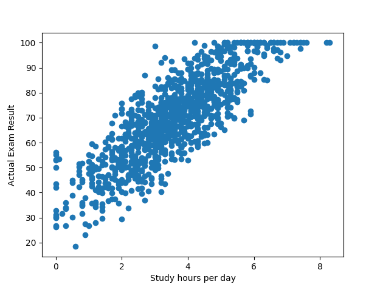
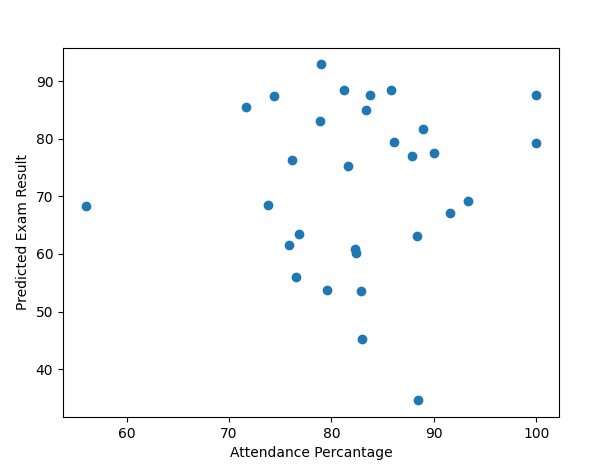

## Introduction:
The model is learning based off the "students.csv" file containg information about:
sleep hours, mental health metric, study hours per day, internet quality, diet quality, social media consumptions and much more.
Multiple Linear regression allows to make relatively good predictions with a MAPE(https://en.wikipedia.org/wiki/Mean_absolute_percentage_error) of 6.19%.

## Case Study(graphs):

