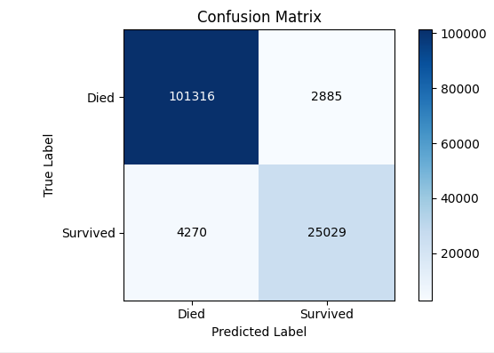
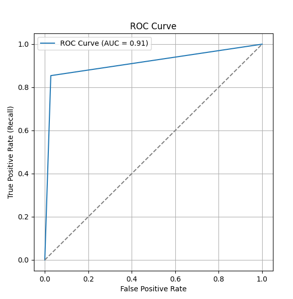
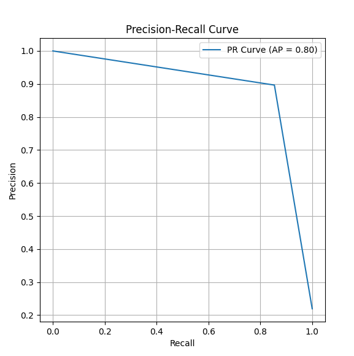

## Introduction
The following project explores the relation between medical parameters and indication of survival.
The file 'dataset_med.csv' is the subject of investigation, the XGBoost(classfier) model predicts labels with an impressive accuracy(see the graphs in the case study).
## Case Study

