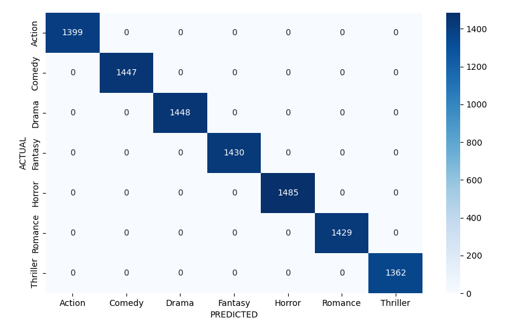
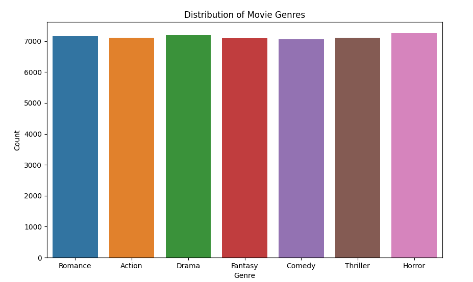
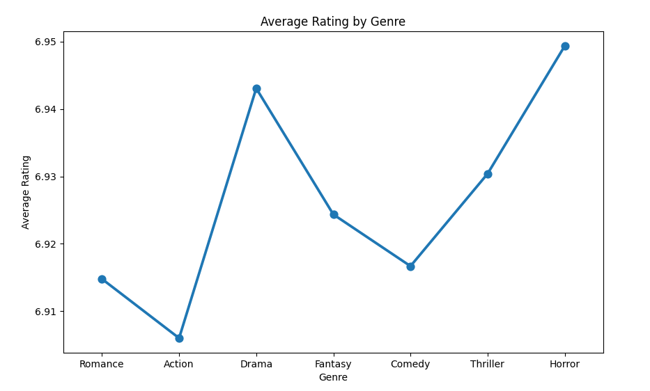
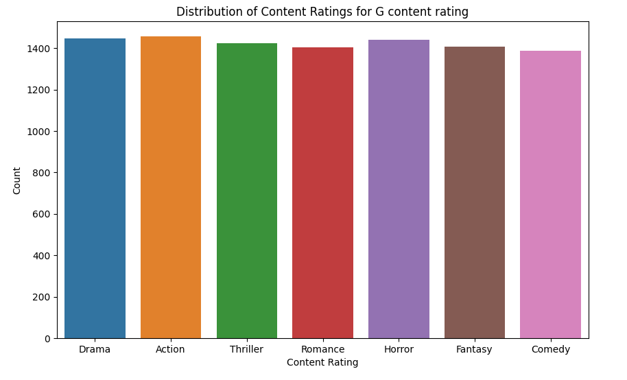
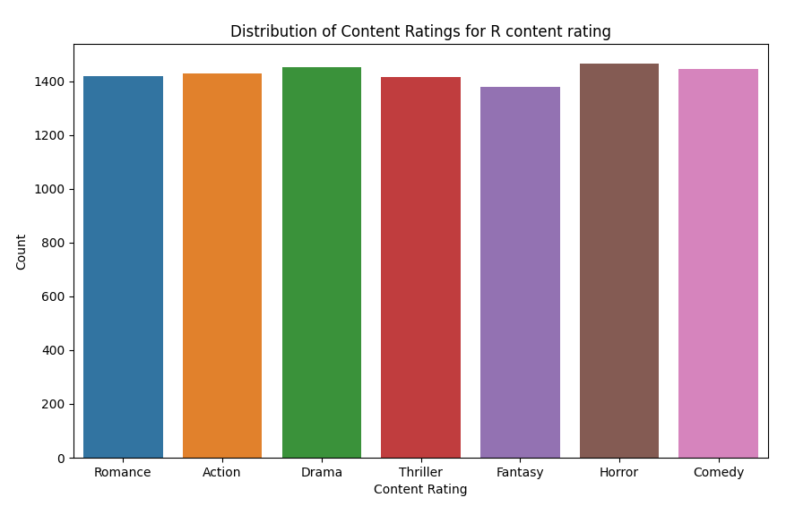
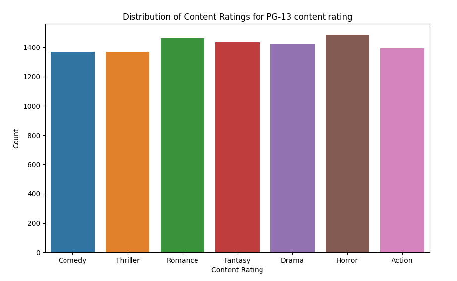
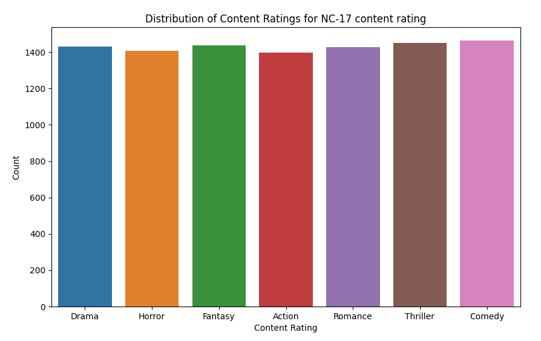
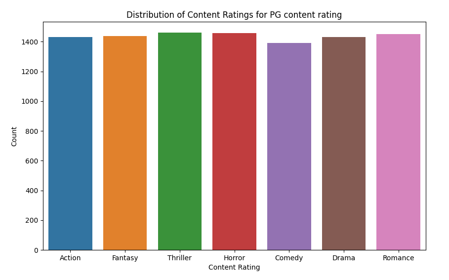

## Introduction
The following program explores a multiclass classification problem in which predicting the movie genre based on external factors(title, description, content rating, rating, etc.) is the ultimate goal. SVM model is used to obtain both an efficent and accurate predictions.
<strong>The description is highly corelated with the final result and causes PERFECT results</strong>, which generally speaking is a red flag, but in this case, there is no data leakage between training and testing subsets. Vectorizer is used to form a BoW(bag of words)
approach aimed at converting strings into columns and further analysis of their appearances in descriptions/titles. 

## Case Study

