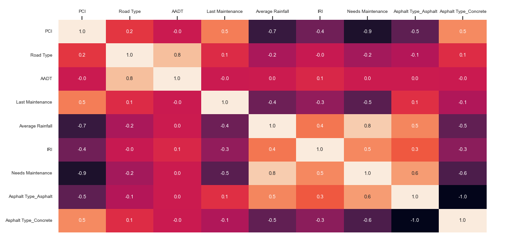
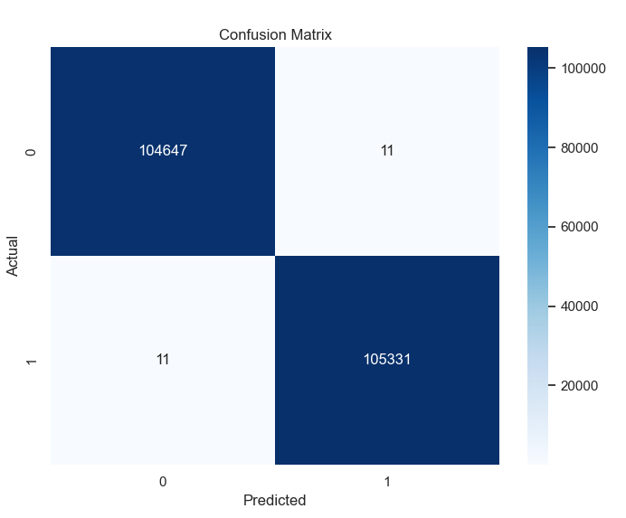
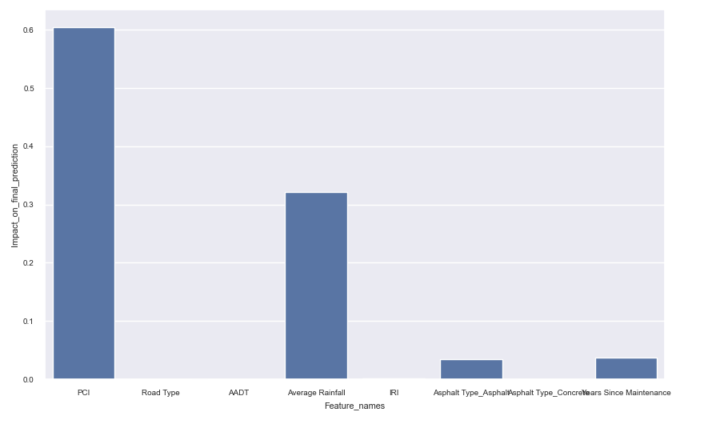

## Introduction
The following machine learning model investigates the 'pavement.csv' dataset, which is a typical classification based spreadsheet.
XGBoost classification algorithm is used to predict the need of maintenance/renovation.

## Case Study

