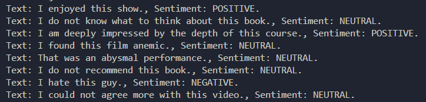
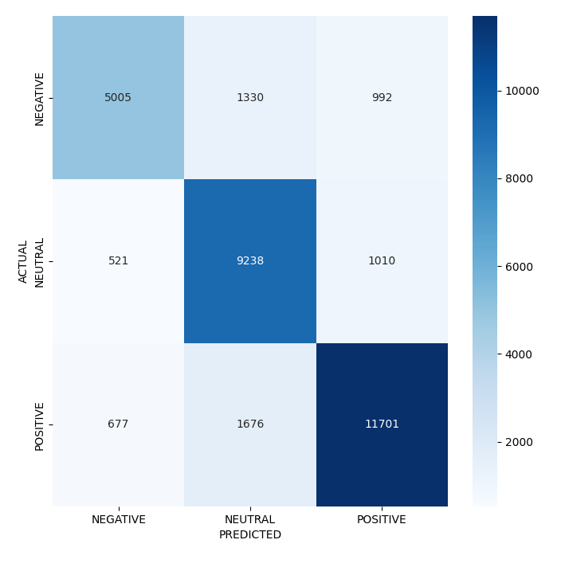
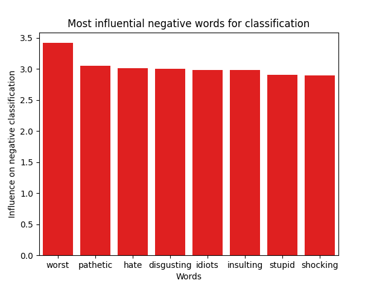
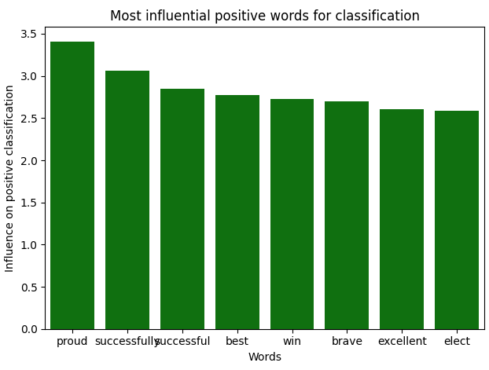

## Introduction
The following project explores the Natural Language Processing topic based on sample sentiment analysis from 'sentiment_data.csv'.
The model is based on an SVM classification algorithm, which achieves a reasonably good accuracy. This is a multiclass classification problem- the sentiment can be either positive, neutral or negative.

## Case Study

