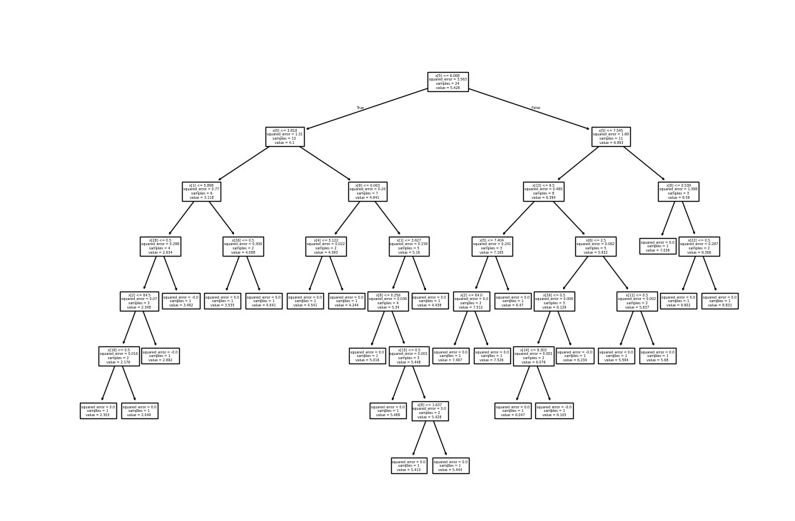

## Introduction
The following machine learning model explores the job satisfaction level based on parameters in
social_media_vs_productivity.csv. It is done so, by means of decision tree regresor algorithm with a MSE of 1.85 and R^2 of 0.59.
The job_satisfaction_score is one the scale 0-10.
## Case Study

