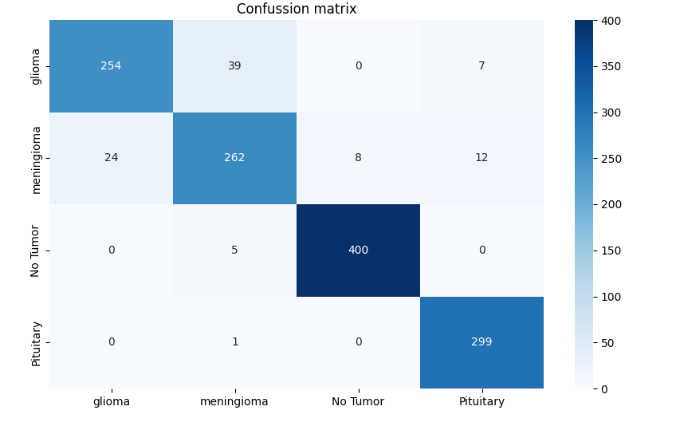
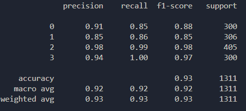

## Introduction
The following repo contains a well-known Machine Learning problem within the paradigm of Computer Vision. The brain MRI dataset (https://www.kaggle.com/datasets/masoudnickparvar/brain-tumor-mri-dataset) is used. SVM model provides a high accuracy and efficiency.

## Case Study

<strong>Where: 
        0: Glioma 
        1: Meningioma 
        2: No Tumor 
        3: Pituitary
</strong>
